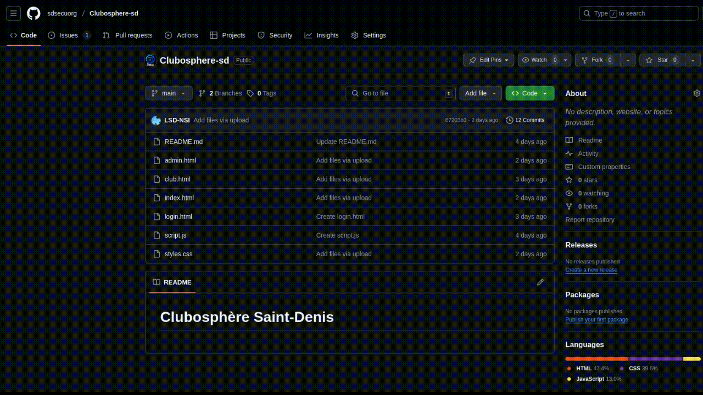
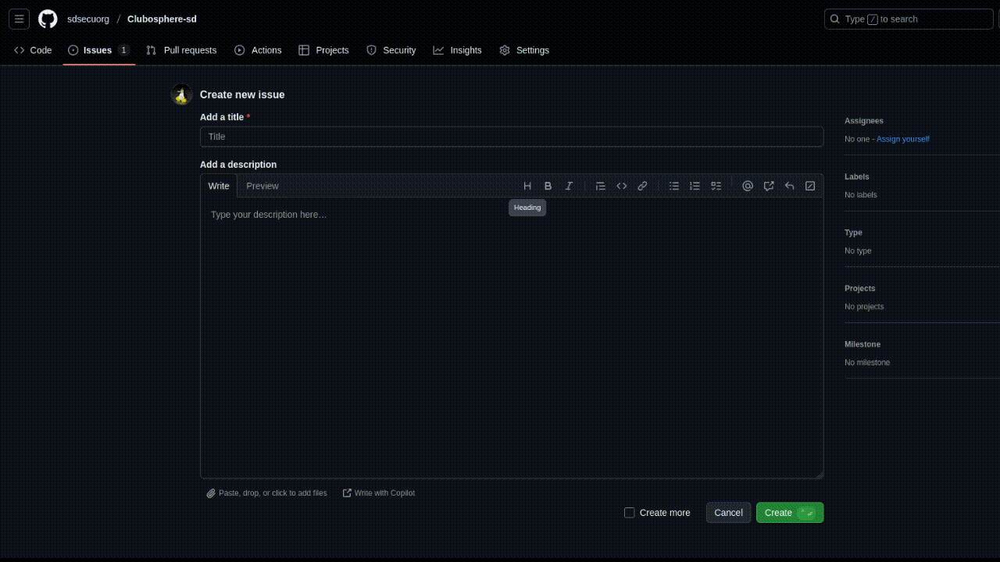
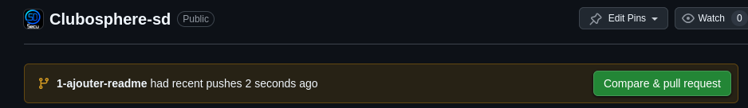
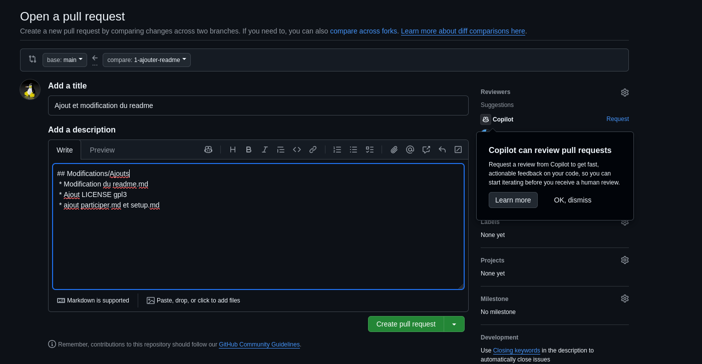

# Contribuer au projet

## Créer une issue

Pour contribuer, il suffit de créer une nouvelle issue.



Veuillez ajouter un descriptif clair à l’issue.



Ensuite, créez une nouvelle branche à partir de main.

Vous pouvez ensuite vous déplacer sur cette nouvelle branche :

```
git pull
git checkout <votre-nouvelle-branche>
```
Vous pouvez maintenant commencer à apporter vos modifications !

## Merge dans main

Une fois que vous avez effectué vos modifications, vous devez créer une **pull request**.

Cliquez sur `Compare & pull request`.



Ajoutez un titre et une description complète.

Ensuite, cliquez sur `Create pull request`.



Vous devez ensuite attendre que votre pull request soit validée par un autre contributeur.

Une fois validée, vous pouvez fusionner vos modifications dans `main`.
